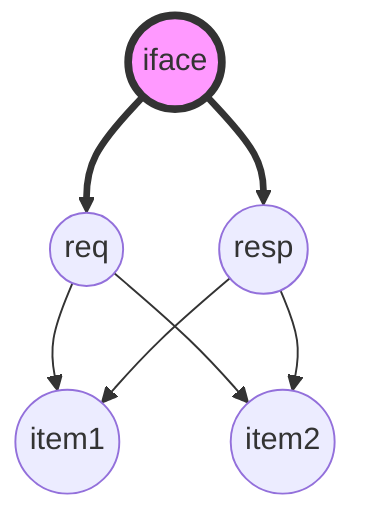

## BFF AstTree

~~~flow
```
st=>start: T-I
op1=>end: ExtraNode(Request)
e=>end: LeafNode	
st->op1->e
```
~~~


```mermaid
graph TB
	topNode((iface)) ==> req((req))
	style topNode fill:#f9f,stroke:#333,stroke-width:4px
	topNode((iface)) ==> resp((resp))
	req((req)) --> req1((item1))
	req((req)) --> req2((item2))
	resp((resp)) --> req1((item1))
	resp((resp)) --> req2((item2))
	
```

